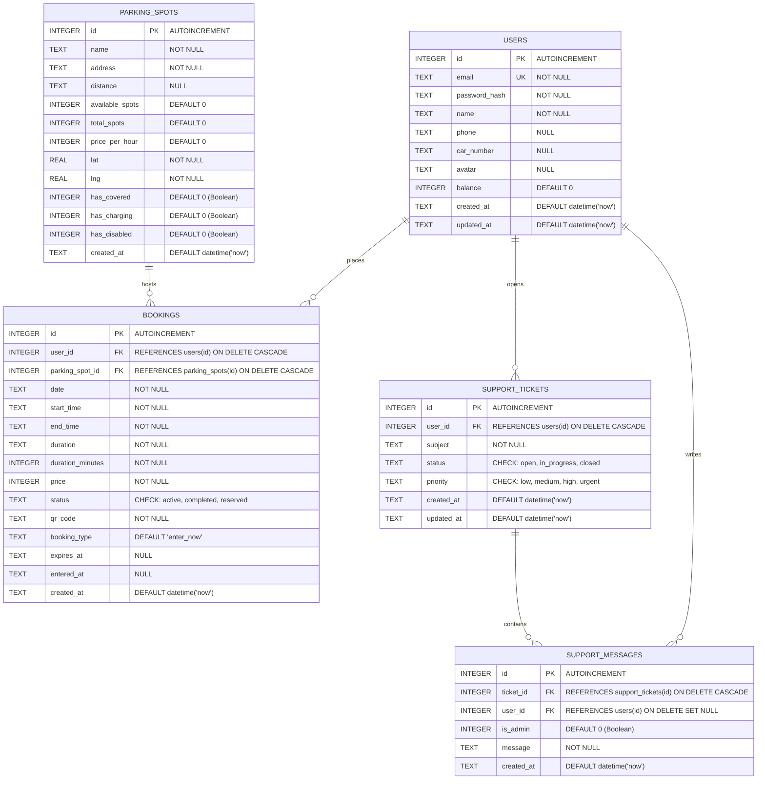

# Parking App Database UML & ERD

This document provides a comprehensive view of the SQLite database schema used by the Parking App. The database covers user management, parking spot details, reservation bookings, customer support tickets, and direct messaging history.

---

## 📊 Entity Relationship Diagram (ERD)

The diagram below represents the tables, columns, keys, and foreign-key relationships. It uses standard Crow's Foot notation to show cardinality:
* `||--o{` represents a **one-to-many** relationship (e.g., one user can make zero or more bookings).
* `||--|{` represents a **one-to-many (at least one)** relationship.

---

## 🗄️ Detailed Table Specifications

### 1. `users`
Stores user profile information, authentication credentials, and user account balances.

| Column | Type | Constraints | Description |
| :--- | :--- | :--- | :--- |
| `id` | `INTEGER` | `PRIMARY KEY AUTOINCREMENT` | Unique identifier for each user |
| `email` | `TEXT` | `UNIQUE NOT NULL` | Email address used for authentication |
| `password_hash`| `TEXT` | `NOT NULL` | Hashed password |
| `name` | `TEXT` | `NOT NULL` | Full name of the user |
| `phone` | `TEXT` | `NULL` | Contact phone number |
| `car_number` | `TEXT` | `NULL` | User's vehicle license plate number |
| `avatar` | `TEXT` | `NULL` | URL or filename of user avatar image |
| `balance` | `INTEGER`| `DEFAULT 0` | Current virtual balance (in minor currency units/cents) |
| `created_at` | `TEXT` | `DEFAULT (datetime('now'))` | Timestamp of account creation (ISO 8601 text format) |
| `updated_at` | `TEXT` | `DEFAULT (datetime('now'))` | Timestamp of last profile update (ISO 8601 text format) |

---

### 2. `parking_spots`
Stores information about carparks and their capacities, location coordinates, pricing, and amenities.

| Column | Type | Constraints | Description |
| :--- | :--- | :--- | :--- |
| `id` | `INTEGER` | `PRIMARY KEY AUTOINCREMENT` | Unique identifier for the parking spot |
| `name` | `TEXT` | `NOT NULL` | Name of the parking spot/facility |
| `address` | `TEXT` | `NOT NULL` | Full physical address |
| `distance` | `TEXT` | `NULL` | Text representation of distance from a benchmark location (e.g. "200m") |
| `available_spots`| `INTEGER` | `NOT NULL DEFAULT 0` | Number of currently available vacant spaces |
| `total_spots` | `INTEGER` | `NOT NULL DEFAULT 0` | Total parking capacity of the facility |
| `price_per_hour` | `INTEGER` | `NOT NULL DEFAULT 0` | Rate charged per hour (in minor currency units/cents) |
| `lat` | `REAL` | `NOT NULL` | Latitude coordinate for map positioning |
| `lng` | `REAL` | `NOT NULL` | Longitude coordinate for map positioning |
| `has_covered` | `INTEGER` | `DEFAULT 0` | Boolean (0/1) indicating covered parking availability |
| `has_charging` | `INTEGER` | `DEFAULT 0` | Boolean (0/1) indicating EV charging station presence |
| `has_disabled` | `INTEGER` | `DEFAULT 0` | Boolean (0/1) indicating accessible parking spot presence |
| `created_at` | `TEXT` | `DEFAULT (datetime('now'))` | Timestamp of spot listing (ISO 8601 text format) |

---

### 3. `bookings`
Contains records of parking spot reservations made by users.

| Column | Type | Constraints | Description |
| :--- | :--- | :--- | :--- |
| `id` | `INTEGER` | `PRIMARY KEY AUTOINCREMENT` | Unique reservation identifier |
| `user_id` | `INTEGER` | `NOT NULL REFERENCES users(id) ON DELETE CASCADE` | ID of the booking user |
| `parking_spot_id`| `INTEGER` | `NOT NULL REFERENCES parking_spots(id) ON DELETE CASCADE` | ID of the reserved parking spot |
| `date` | `TEXT` | `NOT NULL` | Calendar date of the reservation |
| `start_time` | `TEXT` | `NOT NULL` | Scheduled check-in time |
| `end_time` | `TEXT` | `NOT NULL` | Scheduled check-out time |
| `duration` | `TEXT` | `NOT NULL` | Text duration representation (e.g. "2h 30m") |
| `duration_minutes`| `INTEGER` | `NOT NULL` | Total booking duration in minutes |
| `price` | `INTEGER` | `NOT NULL` | Total charge for the booking |
| `status` | `TEXT` | `NOT NULL CHECK (status IN ('active', 'completed', 'reserved'))` | Current status of the reservation |
| `qr_code` | `TEXT` | `NOT NULL` | Unique QR code payload for check-in verification |
| `booking_type` | `TEXT` | `DEFAULT 'enter_now'` | Type of booking flow |
| `expires_at` | `TEXT` | `NULL` | Time at which the pending/reserved booking expires |
| `entered_at` | `TEXT` | `NULL` | Actual gate entry timestamp |
| `created_at` | `TEXT` | `DEFAULT (datetime('now'))` | Timestamp of reservation creation (ISO 8601 text format) |

---

### 4. `support_tickets`
Tracks customer support ticket topics opened by users.

| Column | Type | Constraints | Description |
| :--- | :--- | :--- | :--- |
| `id` | `INTEGER` | `PRIMARY KEY AUTOINCREMENT` | Unique ticket identifier |
| `user_id` | `INTEGER` | `NOT NULL REFERENCES users(id) ON DELETE CASCADE` | ID of the ticket submitter |
| `subject` | `TEXT` | `NOT NULL` | Title or short subject of the issue |
| `status` | `TEXT` | `NOT NULL DEFAULT 'open' CHECK (status IN ('open', 'in_progress', 'closed'))` | Ticket resolution status |
| `priority` | `TEXT` | `NOT NULL DEFAULT 'medium' CHECK (priority IN ('low', 'medium', 'high', 'urgent'))` | Severity rank |
| `created_at` | `TEXT` | `DEFAULT (datetime('now'))` | Timestamp of ticket creation (ISO 8601 text format) |
| `updated_at` | `TEXT` | `DEFAULT (datetime('now'))` | Timestamp of last ticket activity (ISO 8601 text format) |

---

### 5. `support_messages`
Stores individual messages belonging to support tickets.

| Column | Type | Constraints | Description |
| :--- | :--- | :--- | :--- |
| `id` | `INTEGER` | `PRIMARY KEY AUTOINCREMENT` | Unique message identifier |
| `ticket_id` | `INTEGER` | `NOT NULL REFERENCES support_tickets(id) ON DELETE CASCADE` | Link to the parent ticket |
| `user_id` | `INTEGER` | `REFERENCES users(id) ON DELETE SET NULL` | ID of the sender (null if deleted or system generated) |
| `is_admin` | `INTEGER` | `NOT NULL DEFAULT 0` | Boolean (0/1) indicating if the sender was a support agent |
| `message` | `TEXT` | `NOT NULL` | Markdown or plaintext message content |
| `created_at` | `TEXT` | `DEFAULT (datetime('now'))` | Timestamp of message delivery (ISO 8601 text format) |

---

## ⚡ Performance Optimization (Indexes)

To ensure rapid lookup and search efficiency across the database, several database indexes have been built:

1. **`idx_users_email`** on `users(email)`
   * *Purpose*: Speeds up authentication lookups and enforces the unique constraint validation during login/registration.
2. **`idx_bookings_user_id`** on `bookings(user_id)`
   * *Purpose*: Speeds up dashboard loads for users checking their booking history.
3. **`idx_bookings_status`** on `bookings(status)`
   * *Purpose*: Speeds up filtering for active or expired reservations on active dashboard panels.
4. **`idx_bookings_expires_at`** on `bookings(expires_at)`
   * *Purpose*: Optimizes queries that identify and release expired/unclaimed reservations.
5. **`idx_support_tickets_user_id`** on `support_tickets(user_id)`
   * *Purpose*: Accelerates user queries to view their support ticket history.
6. **`idx_support_tickets_status`** on `support_tickets(status)`
   * *Purpose*: Allows support agents to quickly filter unresolved tickets.
7. **`idx_support_messages_ticket_id`** on `support_messages(ticket_id)`
   * *Purpose*: Speeds up chat thread retrieval when loading a specific ticket details page.
